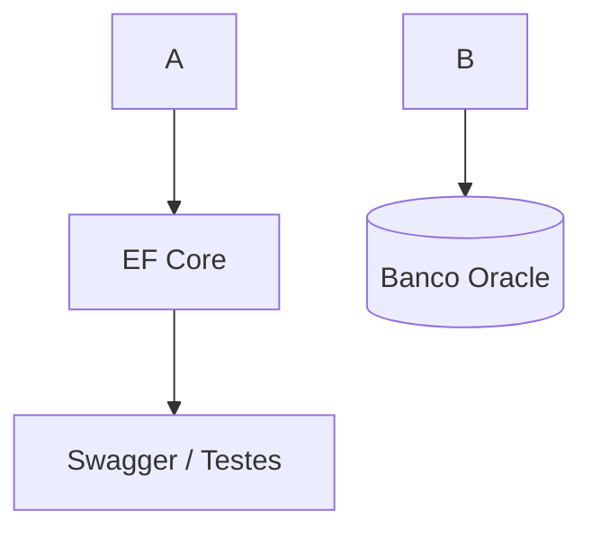
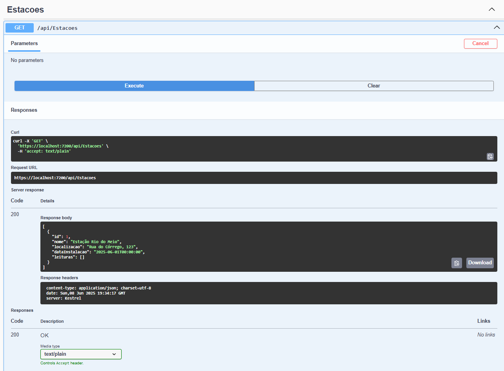
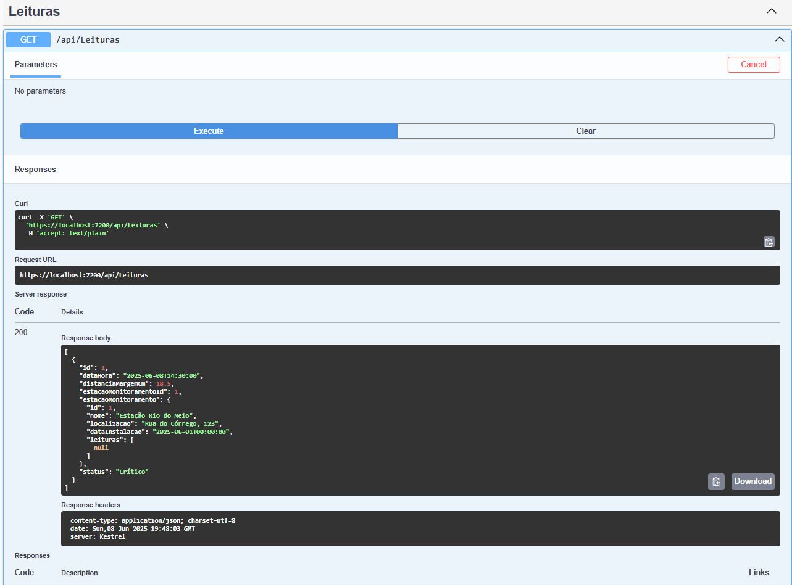

# 🌊 HidroSafe.API

## 👥 Integrantes

| Nome               | RM     |
|--------------------|--------|
| Guilherme Guimarães| [RM557074] Turma:  2TDSA
| Matheus Oliveira de Luna | [RM555547] Turma: 2TDSA
| Nicollas Guedes Pontes | [RM556850] Turma:  2TDSB

## 🎥 Links para os vídeos:
* Demonstração da solução completa: https://youtu.be/UtORxBwXob0
* Pitch de apresentação: https://youtu.be/EpZtc4Rvggw

## 🔎 Visão Geral

O projeto **HidroSafe** foi concebido como uma resposta tecnológica ao desafio crescente das enchentes em áreas urbanas e periféricas, especialmente em comunidades ribeirinhas e regiões de encosta. A proposta visa oferecer um sistema de monitoramento de nível da água baseado em Internet das Coisas (IoT), capaz de emitir alertas em tempo real, contribuindo diretamente para a segurança da população e para a prevenção de desastres.
O público-alvo da solução são moradores de regiões de risco e agentes da defesa civil, que frequentemente enfrentam situações de alagamento sem aviso prévio. A solução também se destina a gestores públicos que precisam monitorar dados de risco em diferentes pontos da cidade
O Sistema foi desenvolvido em ASP.NET Core 8.0 com Entity Framework Core, Oracle Database e Swagger, com o objetivo de monitorar o nível da água e prevenir enchentes em áreas de risco.

## 🧱 Arquitetura do Projeto



- **Backend (API RESTful):** Responsável por controlar estações de monitoramento e leituras de distância da água.
- **Database:** Oracle XE em container Docker.
- **Documentação:** Swagger com OpenAPI v3.
- **Migrations:** Usadas para controle de versionamento do banco de dados.

## 🧩 Funcionalidades

- ✅ CRUD de Estações de Monitoramento (`/api/Estacoes`)
- ✅ CRUD de Leituras de Distância (`/api/Leituras`)
- ✅ Cálculo de Status baseado na distância:
  - > 60cm = Normal
  - 41–60cm = Atenção
  - 21–40cm = Alerta
  - <= 20cm = Crítico
- ✅ Dados populados automaticamente via Migrations (Seed)

## 🚀 Como Executar o Projeto

### Pré-requisitos

- [.NET SDK 8.0](https://dotnet.microsoft.com/)
- Oracle Database (local ou Docker)
- Visual Studio ou Visual Studio Code

### Rodar via Visual Studio

1. Abra o projeto `HidroSafe.API.sln`
2. Defina o projeto `HidroSafe.API` como inicial.
3. Execute com IIS Express ou Kestrel.

### Rodar via VS Code ou Terminal

```bash
dotnet restore
dotnet ef database update
dotnet run
```

### Acessar Swagger

Acesse:
```
https://localhost:7200/swagger
```

## 🛠️ Testes com Swagger

### 📥 POST Estação

```json
POST /api/Estacoes
{
  "nome": "Estação Leste",
  "localizacao": "Rua das Águas, 45",
  "dataInstalacao": "2025-06-08T00:00:00"
}
```

### 📥 POST Leitura

```json
POST /api/Leituras
{
  "dataHora": "2025-06-08T18:00:00",
  "distanciaMargemCm": 70.0,
  "estacaoMonitoramentoId": 2
}
```

## 🧪 Testes Realizados

- ✔️ Testes manuais no Swagger para todos os endpoints
- ✔️ Verificação de Status gerado corretamente
- ✔️ Consulta de Leituras com `Include` para navegação
- ✔️ Migração e seed verificados com `SELECT * FROM "__EFMigrationsHistory"`

## 🗃️ Migrations

```bash
dotnet ef migrations add Inicial
dotnet ef database update
```

Verificar no Oracle:
```sql
SELECT * FROM "__EFMigrationsHistory";
SELECT * FROM "leituras";
SELECT * FROM "estacoes";
```

## 📁 Estrutura de Pastas

```
HidroSafe.API/
├── Controllers/
├── Data/
├── Migrations/
├── Models/
├── Properties/
├── Program.cs
├── appsettings.json
```

## 📸 Imagens do Sistema







## 📚 Tecnologias Utilizadas

- ASP.NET Core 8.0
- Entity Framework Core 8.0
- Oracle.EntityFrameworkCore
- Swagger / Swashbuckle.AspNetCore
- Visual Studio / VS Code

## 👨‍🏫 Projeto Acadêmico

✅ Projeto desenvolvido para fins acadêmicos com foco em resiliência urbana e suporte digital em cenários de desastre.